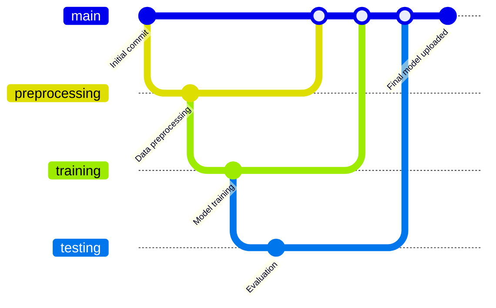

# 🔀 Git Workflow Diagram

This diagram shows the flow of Git operations used in this project.

```mermaid
gitGraph
   commit id: "Initial commit"
   branch preprocessing
   checkout preprocessing
   commit id: "Data preprocessing"
   branch training
   checkout training
   commit id: "Model training"
   branch testing
   checkout testing
   commit id: "Evaluation"
   checkout main
   merge preprocessing
   merge training
   merge testing
   commit id: "Final model uploaded"
```
