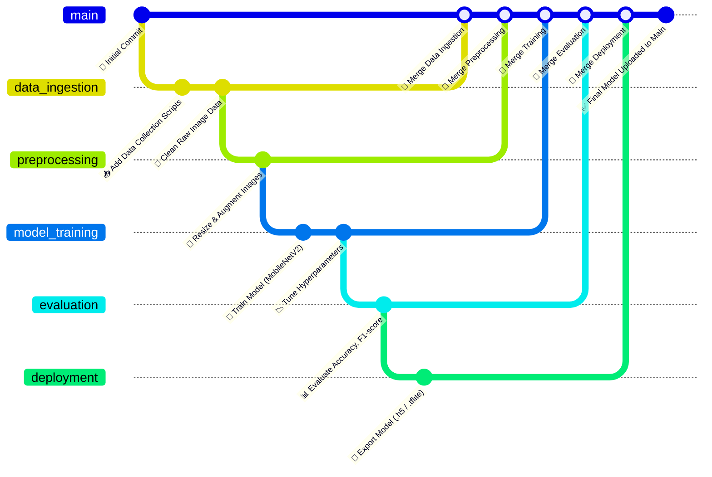

# 🔀 Professional Git Workflow Diagram

This diagram illustrates the Git-based development process for the Poultry Disease Detection project using deep learning and computer vision.

```mermaid
gitGraph
   commit id: "📁 Initial Commit"
   branch data_ingestion
   checkout data_ingestion
   commit id: "📥 Add Data Collection Scripts"
   commit id: "🧹 Clean Raw Image Data"
   branch preprocessing
   checkout preprocessing
   commit id: "🔄 Resize & Augment Images"
   branch model_training
   checkout model_training
   commit id: "🧠 Train Model (MobileNetV2)"
   commit id: "📉 Tune Hyperparameters"
   branch evaluation
   checkout evaluation
   commit id: "📊 Evaluate Accuracy, F1-score"
   branch deployment
   checkout deployment
   commit id: "🚀 Export Model (.h5 / .tflite)"
   checkout main
   merge data_ingestion id: "🔀 Merge Data Ingestion"
   merge preprocessing id: "🔀 Merge Preprocessing"
   merge model_training id: "🔀 Merge Training"
   merge evaluation id: "🔀 Merge Evaluation"
   merge deployment id: "🔀 Merge Deployment"
   commit id: "✅ Final Model Uploaded to Main"
```
